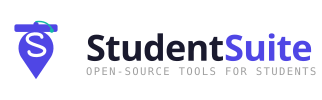

<picture>
  <source media="(prefers-color-scheme: dark)" srcset="./logo-lockup-dark.svg">
  
</picture>

# Awesome Student Resources

A curated list of the best software, tools, textbooks, channels, and resources for students.

---

This is a curation list, not a code library. Every entry links out to a tool, channel, or book maintained by someone else, not to something hosted here. Any student, anywhere: add yours by opening a PR, see [CONTRIBUTING.md](CONTRIBUTING.md).

This list covers life around school: discounts, money, career prep, and wellbeing. [Awesome Study Resources](https://github.com/StudentSuite/awesome-study-resources) covers exam, curriculum, and subject-specific study material instead, and [Awesome Skills & Plugins for Students](https://github.com/StudentSuite/awesome-skills-plugins-for-students) covers AI coding-agent skills and plugins built for students. They stay separate because the logistics of being a student and the coursework itself call for different resources, and splitting keeps each list focused enough to be useful.

> Entries note when something is free, freemium, paid, or open source (FOSS), so you know before you click. Resources within each list are ordered alphabetically. See the [Quality Standards](#quality-standards) for what earns a spot.
>
> Maintained by [StudentSuite](https://github.com/StudentSuite) &middot; [Report a broken link](https://github.com/StudentSuite/awesome-student-resources/issues/new/choose) &middot; [Ask a question](https://github.com/StudentSuite/awesome-student-resources/discussions) &middot; [Changelog](CHANGELOG.md)

---

## Table of Contents

|     | Section                                                                        | Resources |
| :-: | ------------------------------------------------------------------------------ | :-------: |
| 🎓  | [Student Discounts & Free Access](#student-discounts--free-access)             |    13     |
| 💰  | [Scholarships & Financial Aid](#scholarships--financial-aid)                   |    14     |
| 💵  | [Financial Literacy & Money Management](#financial-literacy--money-management) |    12     |
| 🎯  | [University & Career Prep](#university--career-prep)                           |    30     |
| 🔧  | [Vocational & Alternative Paths](#vocational--alternative-paths)               |     9     |
| 🎤  | [Debate & Public Speaking](#debate--public-speaking)                           |    10     |
| 🏠  | [Homeschooling](#homeschooling)                                                |    14     |
| 🔓  | [FOSS Picks](#foss-picks)                                                      |    17     |
| 🎧  | [Blogs, Newsletters & Podcasts](#blogs-newsletters--podcasts)                  |    11     |
| 📖  | [Books We Trust](#books-we-trust)                                              |    11     |
| 💡  | [Guides & How-Tos](#guides--how-tos)                                           |    10     |
| 🧘  | [Mental Health & Wellbeing](#mental-health--wellbeing)                         |    12     |
| 👥  | [Communities](#communities)                                                    |    14     |

[More from StudentSuite](#more-from-studentsuite) &middot; [Sister lists](#sister-lists) &middot; [A Note on Links](#a-note-on-links) &middot; [Quality Standards](#quality-standards) &middot; [Contributing](#contributing) &middot; [Contributors](#contributors) &middot; [License](#license)

> Looking for quiet study spots or exam locations? [StudyMap](https://github.com/StudentSuite/StudyMap) is a crowdsourced map of student-important places like libraries and exam centres.

---

## Student Discounts & Free Access

Legitimate free or discounted access students often miss, verify with a school email or proof of enrollment.

Show resources

- **[Adobe Creative Cloud](https://www.adobe.com/creativecloud/buy/students.html)** - Discounted Creative Cloud subscription for verified students (paid).
- **[Amazon Prime Student](https://www.amazon.com/joinstudent)** - Free six-month trial, then discounted Prime shipping and streaming (freemium).
- **[Apple Education Store](https://www.apple.com/us-edu/store)** - Official discount pricing on Mac and iPad for students (paid).
- **[Autodesk Education](https://www.autodesk.com/education/edu-software/overview)** - Free one-year access to Autodesk design and engineering software for verified students (free).
- **[Canva for Education](https://www.canva.com/education/)** - Canva's paid design tools free for verified K-12 students and teachers (free).
- **[Figma Education](https://www.figma.com/education/)** - Figma's paid plan free for students and educators with verification (free).
- **[GitHub Student Developer Pack](https://education.github.com/pack)** - Free developer tools and credits for verified students (free).
- **[Grammarly for Education](https://www.grammarly.com/edu)** - AI writing assistant free for verified students and schools (freemium).
- **[JetBrains for Students](https://www.jetbrains.com/academy/student-pack/)** - All JetBrains IDEs free for students with a school email (free).
- **[Microsoft 365 Education](https://www.microsoft.com/en-us/education/products/office)** - Free Word, Excel, PowerPoint, and Teams with a school email (free).
- **[Notion for Education](https://www.notion.com/product/notion-for-education)** - Notion's paid plan free for students with a school email (free).
- **[Spotify Premium Student](https://www.spotify.com/student/)** - Discounted ad-free music streaming for verified students (paid).
- **[UNiDAYS](https://www.myunidays.com)** - Free student-verification platform unlocking discounts across hundreds of brands (free).

---

## Scholarships & Financial Aid

Legitimate, fee-free places to find money for school.

Show resources

- **[Bold.org](https://bold.org)** - Free, no-fee scholarships matched to your profile daily (free).
- **[Buddy4Study](https://www.buddy4study.com)** - India's largest free scholarship search platform for students (free).
- **[Erasmus Mundus Joint Masters](https://erasmus-plus.ec.europa.eu/opportunities/individuals/students/erasmus-mundus-joint-masters)** - EU-funded full scholarships for joint master's programmes worldwide.
- **[Fastweb](https://www.fastweb.com)** - Free scholarship search vetted against 1,000+ college partners (free).
- **[Federal Student Aid](https://studentaid.gov)** - The official FAFSA portal for US grants, work-study, and loans (free).
- **[FindAPhD](https://www.findaphd.com)** - Free search across PhD studentships, funding, and scholarships worldwide (free).
- **[International Scholarships](https://www.internationalscholarships.com)** - Free searchable database of global scholarships for international students (free).
- **[LASPAU](https://www.laspau.org)** - Nonprofit scholarship and fellowship programs for students across Latin America and the Caribbean (free).
- **[Mastercard Foundation Scholars Program](https://mastercardfdn.org/en/our-work/current-programs/scholars-program/)** - Free, no-fee scholarships and mentorship for African students (free).
- **[Scholars4Dev](https://www.scholars4dev.com)** - Free scholarship search engine for students across Asia, Africa, and other developing regions (free).
- **[Scholarships.com](https://www.scholarships.com)** - Free, vetted search across millions of scholarships and grants (free).
- **[Society of Women Engineers Scholarships](https://swe.org/apply-for-a-swe-scholarship/)** - Free-to-apply scholarships for women pursuing engineering degrees (free).
- **[Study in Japan](https://www.studyinjapan.go.jp/en/planning/scholarships/)** - Japanese government hub for MEXT, JASSO, and university scholarships to study in Japan (free).
- **[The Scholarship Hub](https://www.thescholarshiphub.org.uk)** - No-fee search across UK scholarships, bursaries, and grants (free).

---

## Financial Literacy & Money Management

Budgeting, credit, and banking basics for the money you already have.

Show resources

- **[Consumer Financial Protection Bureau](https://www.consumerfinance.gov/paying-for-college/repay-student-debt/)** - The US government's free guide to federal and private student loan repayment options (free).
- **[Credit Karma](https://www.creditkarma.com)** - Free credit score monitoring and personalized financial guidance (free).
- **[Financial Consumer Agency of Canada](https://www.canada.ca/en/financial-consumer-agency.html)** - The Canadian government's official financial literacy and money-management hub (free).
- **[Khan Academy Personal Finance](https://www.khanacademy.org/college-careers-more/personal-finance)** - Free course covering budgeting, credit, and investing basics (free).
- **[Money Saving Expert](https://www.moneysavingexpert.com)** - Martin Lewis's free UK consumer and student money guidance (free).
- **[MoneyHelper](https://www.moneyhelper.org.uk)** - UK government-backed, free guidance on student loan repayment and money management (free).
- **[MoneySmart](https://moneysmart.gov.au)** - The Australian government's official financial literacy and calculator hub (free).
- **[MyMoney.gov](https://www.mymoney.gov)** - The official US government financial literacy hub (free).
- **[National Centre for Financial Education](https://ncfe.org.in)** - India's official financial literacy and money-management hub (free).
- **[Practical Money Skills](https://www.practicalmoneyskills.com)** - Visa's free global financial literacy program and resources (free).
- **[Sorted](https://sorted.org.nz)** - New Zealand's free, government-backed personal finance guidance and tools (free).
- **[YNAB](https://www.ynab.com)** - Budgeting app with a free year-long trial for verified students (freemium).

---

## University & Career Prep

What comes after exams: applications, resumes, interviews, and time away from the classroom.

### Applications & Resumes

Show resources

- **[AAUW Work Smart](https://www.aauw.org/resources/programs/salary-negotiation/)** - Free self-paced online training on negotiating salary and job offers (free).
- **[AHEAD](https://www.ahead.org)** - Resources on requesting disability accommodations and services at university (free).
- **[CollegeVine](https://www.collegevine.com)** - Free peer and expert reviews for your college application essays (freemium).
- **[Common App](https://www.commonapp.org)** - The official application portal used by 1,000+ colleges (free).
- **[Exponent](https://www.tryexponent.com/practice)** - Free peer and AI mock interviews for tech and PM roles (freemium).
- **[Novoresume](https://novoresume.com)** - Free, ATS-friendly resume builder with student-focused templates (freemium).
- **[OUAC](https://www.ouac.on.ca)** - The official application portal for undergraduate admission to Ontario universities (free).
- **[PracHub](https://prachub.com/interview-guide)** - Browse interview guides and questions by company, role, and topic (free).
- **[The Muse](https://www.themuse.com/advice/cover-letter)** - Free cover letter guides, templates, and examples (free).
- **[Transferology](https://www.transferology.com)** - Free tool to check how your course credits transfer between US colleges (free).
- **[UAC](https://www.uac.edu.au)** - The official university application portal for New South Wales and the ACT, Australia (free).
- **[UCAS](https://www.ucas.com)** - The official UK application portal for undergraduate degree courses (free).
- **[Yoodli](https://yoodli.ai)** - Free AI coach for interview and communication practice (freemium).

### Gap Year & Study Abroad

Show resources

- **[DA Global](https://daglobal.org)** - Global education access network, formerly Diversity Abroad, covering study abroad and student global programs (free).
- **[Erasmus+](https://erasmus-plus.ec.europa.eu)** - The EU's official student mobility and exchange program (free).
- **[EU Immigration Portal](https://immigration-portal.ec.europa.eu)** - Official European Commission guidance on study visas and residence permits across the EU (free).
- **[Gap Year Association](https://www.gapyearassociation.org)** - Accredited gap year program directory and planning resources (free).
- **[GoAbroad](https://www.goabroad.com)** - Directory of study abroad, volunteer, and internship programs worldwide (freemium).
- **[International Student Insurance](https://www.internationalstudentinsurance.com)** - Compare travel and health insurance plans built for study-abroad students (freemium).
- **[New Colombo Plan](https://www.dfat.gov.au/people-to-people/new-colombo-plan)** - Australian government program funding study and internships across the Indo-Pacific (free).
- **[Study in the States](https://studyinthestates.dhs.gov)** - The US Department of Homeland Security's official guidance on the F-1 student visa process (free).
- **[SWAP Working Holidays](https://swap.ca)** - Canada's nonprofit work-and-travel program for gap-year and study/work abroad placements (paid).
- **[Turing Scheme](https://www.turing-scheme.org.uk)** - The UK's official global study and work abroad funding scheme (free).

### Part-Time & Student Jobs

Show resources

- **[Handshake](https://joinhandshake.com)** - Free campus recruiting platform connecting students to part-time jobs and internships (free).
- **[Internshala](https://internshala.com)** - India's leading internship and part-time job platform for students (free).
- **[Milkround](https://www.milkround.com)** - The UK's leading student and graduate job board for part-time work, internships, and schemes (free).
- **[Snagajob](https://www.snagajob.com)** - Free marketplace for hourly and part-time jobs near campus (free).
- **[StudentJob](https://www.studentjob.co.uk)** - Free student job board covering part-time work and internships across nine European countries (free).
- **[Upwork](https://www.upwork.com)** - Global freelance marketplace for remote work you can do from anywhere (freemium).
- **[WayUp](https://www.wayup.com)** - Free job board for internships and part-time work aimed at students (free).

---

## Vocational & Alternative Paths

Apprenticeships, trades, and bootcamps for students on a non-degree path.

Show resources

- **[Apprenticeship.gov](https://www.apprenticeship.gov)** - The official US government registered apprenticeship finder (free).
- **[Australian Apprenticeships](https://www.dewr.gov.au/australian-apprenticeships)** - The Australian government's hub for apprenticeship and traineeship pathways and support (free).
- **[Course Report](https://www.coursereport.com)** - Free directory and reviews of coding and tech bootcamps worldwide (free).
- **[Find an Apprenticeship](https://www.gov.uk/apply-apprenticeship)** - The official UK government apprenticeship search and application service (free).
- **[Make it in Germany](https://www.make-it-in-germany.com)** - The official German government portal for finding an Ausbildung vocational training placement (free).
- **[Mike Rowe Works Foundation](https://www.mikeroweworks.org)** - Nonprofit scholarships and advocacy for skilled trades careers (free).
- **[Onisep](https://www.onisep.fr/formation/apres-la-3-la-voie-professionnelle/apprentissage-se-former-en-alternance)** - France's official public guide to apprenticeship (alternance) training paths, in French (free).
- **[Red Seal Program](https://www.red-seal.ca)** - Canada's interprovincial trade certification and apprenticeship standard (free).
- **[Skill India (NSDC)](https://www.nsdcindia.org)** - India's official government hub for vocational training, skilling programs, and certification (free).

---

## Debate & Public Speaking

Argumentation, Model UN, and speaking skills that carry into essays and interviews.

Show resources

- **[Best Delegate](https://bestdelegate.com)** - Free Model UN guides, cheat sheets, and training resources (freemium).
- **[English-Speaking Union](https://www.esu.org)** - International nonprofit promoting debate, public speaking, and language skills (free).
- **[Global Classrooms](https://www.unanca.org/our-work/programs/global-classrooms)** - UNA-NCA's Model UN curriculum and conferences for grades 5-12, including middle school (free).
- **[How to Ace the Impromptu Speech](https://sixminutes.dlugan.com/how-to-impromptu-speech/)** - Free framework-based guide to structuring impromptu and extemporaneous speeches (free).
- **[IDEA Debatabase](https://idebate.net/resources/debatabase)** - Free database of arguments for and against 700+ debate motions (free).
- **[Jugend debattiert](https://www.jugend-debattiert.de)** - Germany's official youth debate program and training materials, in German (free).
- **[National Model United Nations](https://www.nmun.org)** - Model UN conferences and preparation resources from a nonprofit educational organization (freemium).
- **[National Speech & Debate Association](https://www.speechanddebate.org)** - Topic analysis, competition resources, and event guides (freemium).
- **[ProCon.org](https://www.procon.org)** - Free, nonpartisan pros-and-cons research on debated issues (free).
- **[Toastmasters International](https://www.toastmasters.org)** - Global public-speaking clubs and self-study materials (freemium).

---

## Homeschooling

Curriculum, planning, record-keeping, and the logistics of learning at home.

Show resources

- **[Ambleside Online](https://amblesideonline.org)** - Free, complete Charlotte Mason curriculum with book lists and schedules (free).
- **[DUNEHA](https://duneha.org)** - Free, active homeschooling community and support association for Dubai and the Northern Emirates (free).
- **[Easy Peasy All-in-One Homeschool](https://allinonehomeschool.com)** - Free, complete K-12 curriculum you can follow day by day (free).
- **[Eduscol: L'instruction en famille](https://eduscol.education.gouv.fr/5064/l-instruction-dans-la-famille)** - France's official Ministry of Education guidance on home education authorization (free).
- **[Freedom Homeschooling](https://freedomhomeschooling.com)** - Free directory of free homeschool curricula sorted by subject (free).
- **[GOV.UK Home Education](https://www.gov.uk/home-education)** - Official UK government guidance on home education rights.
- **[Home Education Association](https://www.hea.edu.au)** - Australia's national nonprofit for home educator support, advocacy, and registration guidance (free).
- **[HSLDA](https://hslda.org/legal/)** - US homeschool laws, record-keeping, and testing requirements by state (free).
- **[HSLDA Canada](https://hslda.ca)** - Canadian home education legal protection and guidance.
- **[Pestalozzi Trust](https://pestalozzi.org)** - South African home education legal defense association and guidance (free).
- **[Swashikshan](https://swashikshan.org)** - India's national network and support association for homeschooling families (free).
- **[The Homeschool Mom](https://www.thehomeschoolmom.com)** - Free planners, record-keeping printables, and getting-started guides (free).
- **[Understood.org](https://www.understood.org)** - Free guidance on homeschooling kids with an IEP, 504 plan, or learning difference (free).
- **[Wrightslaw](https://www.wrightslaw.com)** - Special education law, IEP, and Section 504 advocacy guidance (free).

---

## FOSS Picks

Fully free and open-source tools worth installing.

Show resources

- **[Anki](https://apps.ankiweb.net)** - Free, open spaced-repetition flashcards (free).
- **[Cal.com](https://cal.com)** - Free, open-source, self-hostable scheduling and booking tool (free).
- **[Firefly III](https://www.firefly-iii.org)** - Free, open, self-hosted personal finance and budgeting manager (free).
- **[Freeplane](https://www.freeplane.org)** - Free, open mind-mapping tool with AI integration (free).
- **[GIMP](https://www.gimp.org)** - Free, open image editor (free).
- **[Habitica](https://habitica.com)** - Free, open-source habit and task tracker with RPG-style gamification (free).
- **[Inkscape](https://inkscape.org)** - Free, open vector graphics editor (free).
- **[Jitsi Meet](https://meet.jit.si)** - Free, open-source video calls with no account required (free).
- **[Joplin](https://joplinapp.org)** - Free, open note-taking app with markdown and sync (free).
- **[KeePassXC](https://keepassxc.org)** - Free, open-source, offline password manager (free).
- **[Krita](https://krita.org)** - Free, open painting and illustration app (free).
- **[LibreOffice](https://www.libreoffice.org)** - Free, open office suite: documents, spreadsheets, slides (free).
- **[OBS Studio](https://obsproject.com)** - Free, open screen recording and live streaming (free).
- **[Okular](https://okular.kde.org)** - Free, open universal document viewer with annotations (free).
- **[StudyMap](https://github.com/StudentSuite/StudyMap)** - Crowdsourced map of student-important places like exam centres and libraries (free).
- **[Vikunja](https://vikunja.io)** - Free, open task and project manager (free).
- **[Zotero](https://www.zotero.org)** - Free, open reference and citation manager (free).

---

## Blogs, Newsletters & Podcasts

Written and audio deep dives on how to learn, focus, and work better.

Show resources

- **[Breaking Math](https://www.breakingmath.io)** - Weekly conversations making math concepts click (free).
- **[Cortex](https://www.relay.fm/cortex)** - Weekly conversations on productivity systems, tools, and workflows (free).
- **[Deep Questions with Cal Newport](https://www.thedeeplife.com/listen/)** - Weekly podcast on deep work, focus, and study strategy (free).
- **[Farnam Street](https://fs.blog)** - Essays on mental models, decision-making, and clearer thinking (free).
- **[Hidden Brain](https://www.hiddenbrain.org)** - NPR podcast exploring the psychology behind everyday decisions (free).
- **[James Clear's 3-2-1 Newsletter](https://jamesclear.com/3-2-1)** - Weekly ideas, quotes, and questions on habits and learning (free).
- **[Ness Labs Newsletter](https://nesslabs.com/newsletter)** - Neuroscience-backed insights on productivity, focus, and learning (free).
- **[Radiolab](https://radiolab.org)** - Science, philosophy, and human-interest stories from WNYC Studios (free).
- **[Scott Young's Blog](https://www.scotthyoung.com/blog/)** - Deep dives on learning faster and building hard skills (free).
- **[Stuff You Missed in History Class](https://missedinhistory.com)** - Two-a-week deep dives into overlooked history (free).
- **[The Learning Scientists Podcast](https://www.learningscientists.org/learning-scientists-podcast)** - Evidence-based study techniques explained by cognitive scientists (free).

---

## Books We Trust

Study skill and mindset books worth your time.

Show resources

- **[A Mind for Numbers](https://barbaraoakley.com/books/a-mind-for-numbers/)** - Learn math and science even if you struggle (paid).
- **[Atomic Habits](https://jamesclear.com/atomic-habits)** - Build study habits that actually stick (paid).
- **[Deep Work](https://calnewport.com/books/deep-work/)** - Build the ability to focus without distraction (paid).
- **[Grit: The Power of Passion and Perseverance](https://www.angeladuckworth.com/grit)** - Angela Duckworth on why passion and persistence beat raw talent (paid).
- **[How to Take Smart Notes](https://takesmartnotes.com)** - Turn reading into writing with a note system (paid).
- **[Make It Stick](https://www.hup.harvard.edu/books/9780674729018)** - The science of durable, effective learning (paid).
- **[Mindset](https://www.mindsetonline.com)** - Carol Dweck's companion site on growth versus fixed mindsets (paid).
- **[Peak: Secrets from the New Science of Expertise](https://peakthebook.com/)** - Learn deliberate practice for developing expertise (paid).
- **[The 7 Habits of Highly Effective People](https://www.franklincovey.com/books/the-7-habits-of-highly-effective-people/)** - Build habits for effective goals and priorities (paid).
- **[Ultralearning](https://www.scotthyoung.com/blog/ultralearning/)** - Scott Young's strategies for aggressive, self-directed skill learning (paid).
- **[Why We Sleep](https://www.simonandschuster.com/books/Why-We-Sleep/Matthew-Walker/9781501144325)** - Matthew Walker on how sleep drives memory, learning, and health (paid).

---

## Guides & How-Tos

Meta-skills: how to study, remember, and focus.

Show resources

- **[A Realistic Guide to Time Management](https://www.todoist.com/inspiration/time-management)** - Todoist's free guide to time-blocking your calendar and building a workable schedule (free).
- **[Ali Abdaal](https://aliabdaal.com)** - Evidence-based study and productivity guides (free).
- **[Anki Manual](https://docs.ankiweb.net/)** - The official guide to spaced repetition with Anki (free).
- **[Cornell Note-Taking System](https://lsc.cornell.edu/how-to-study/taking-notes/cornell-note-taking-system/)** - Cornell University's official guide to the Cornell note-taking method (free).
- **[How to Remember Anything Forever-ish](https://ncase.me/remember/)** - Playable primer on spaced repetition (free).
- **[Learning How to Learn](https://www.coursera.org/learn/learning-how-to-learn)** - The popular free course on how learning works (freemium).
- **[Pomodoro Technique](https://www.pomodorotechnique.com)** - Francesco Cirillo's official guide to the Pomodoro time-management method (free).
- **[Retrieval Practice](https://www.retrievalpractice.org)** - Pooja Agarwal's free guides on retrieval practice, spacing, and interleaving (free).
- **[Student Guide to Generative AI](https://cep.barnard.edu/student-guide-generative-ai)** - Barnard College's free guide to using AI tools without compromising academic integrity (free).
- **[Zettelkasten.de](https://zettelkasten.de)** - In-depth guide to the Zettelkasten note-taking and thinking method (free).

---

## Mental Health & Wellbeing

Free, reputable support for stress, burnout, and everything school doesn't teach you to handle.

Show resources

- **[7 Cups](https://www.7cups.com)** - Free, anonymous chat with trained volunteer listeners, 24/7 (freemium).
- **[ADDitude](https://www.additudemag.com)** - Strategies and community support for ADHD and neurodivergent students (freemium).
- **[ANAD](https://anad.org/get-support/eating-disorders-helpline/)** - Free peer support and treatment referrals for eating disorders.
- **[Befrienders Worldwide](https://befrienders.org)** - Free directory of confidential emotional-support helplines worldwide (free).
- **[CHADD](https://chadd.org)** - Nonprofit support and resources for ADHD, from Children and Adults with ADHD (free).
- **[Child Mind Institute](https://childmind.org)** - Free, expert guidance on managing test anxiety and exam-day stress (free).
- **[Crisis Text Line](https://www.crisistextline.org)** - Free, 24/7 text-based crisis support with trained counselors (free).
- **[Headspace](https://www.headspace.com)** - Guided meditation and sleep, free for teens and students (freemium).
- **[JED Foundation](https://jedfoundation.org)** - Nonprofit resources on managing finals-week and exam-period burnout (free).
- **[NHS Every Mind Matters](https://www.nhs.uk/every-mind-matters/)** - Free official guidance on stress, anxiety, and sleep (free).
- **[Student Minds](https://www.studentminds.org.uk/advice-and-info/feeling-homesick-at-university/)** - UK student mental health charity's free guide to coping with homesickness at university (free).
- **[The Trevor Project](https://www.thetrevorproject.org)** - Free, confidential crisis support and resources for LGBTQ+ young people (free).

---

## Communities

Ask questions and study alongside other students.

Show resources

- **[Academia Stack Exchange](https://academia.stackexchange.com)** - Q&A on academic life, research, and navigating school systems (free).
- **[AnitaB.org](https://anitab.org)** - Global nonprofit community, mentorship, and career network for women in tech (free).
- **[Focusmate](https://www.focusmate.com)** - Free virtual body-doubling sessions to stay accountable while studying (freemium).
- **[I'm First](https://www.imfirst.org)** - Free community and guidance for first-generation college students (free).
- **[Mathematics Stack Exchange](https://math.stackexchange.com)** - Q&A for working through math problems step by step (free).
- **[oSTEM](https://ostem.org)** - Nonprofit professional association and chapter network for LGBTQ+ people in STEM (free).
- **[r/APStudents](https://www.reddit.com/r/APStudents/)** - Community for AP course and exam prep (free).
- **[r/GetStudying](https://www.reddit.com/r/GetStudying/)** - Study motivation, methods, and accountability (free).
- **[r/HomeworkHelp](https://www.reddit.com/r/HomeworkHelp/)** - Large, active community for help across every school subject (free).
- **[r/IBO](https://www.reddit.com/r/IBO/)** - The main community for IB Diploma students (free).
- **[r/igcse](https://www.reddit.com/r/igcse/)** - Support and resources for IGCSE students (free).
- **[r/SAT](https://www.reddit.com/r/SAT/)** - Strategy, practice, and score discussion for the SAT (free).
- **[Study Together](https://studytogether.com)** - Large Discord and livestream community for study accountability (free).
- **[StudyStream](https://www.studystream.live)** - 24/7 video study rooms and a Discord community to stay accountable (freemium).

---

## More from StudentSuite

- **[Awesome Skills & Plugins for Students](https://github.com/StudentSuite/awesome-skills-plugins-for-students)** - Curated AI coding-agent skills and plugins built for students (free).
- **[Awesome Study Resources](https://github.com/StudentSuite/awesome-study-resources)** - Curated exam, curriculum, and subject-study resources for students (free).
- **[StudyMap](https://github.com/StudentSuite/StudyMap)** - A crowdsourced map of student-important places: exam centres, libraries, and more (free).

---

## Sister lists

- [awesome-study-resources](https://github.com/StudentSuite/awesome-study-resources) - Exam and subject study material.
- [awesome-skills-plugins-for-students](https://github.com/StudentSuite/awesome-skills-plugins-for-students) - AI coding agent skills and plugins.

---

## A Note on Links

> [!NOTE]
> This list points to third-party tools, channels, and books. StudentSuite does not own, host, or endorse them, and it earns nothing from these links. Pricing and free tiers change, so check the current terms before you commit. If a listed entry is dead, misleading, or no longer free where we said so, open an issue or PR to fix it.

---

## Quality Standards

An entry should meet all of the following before being added:

- [ ] **Genuinely useful to students.** It helps you study, build, or organize, not just browse.
- [ ] **Real and maintained.** Actively available, not abandoned or a dead link.
- [ ] **Accessible.** Free, freemium, or clearly worth the price; note the pricing in the entry.
- [ ] **Reputable.** A known tool, channel, or book, not spam or an affiliate funnel.
- [ ] **Short description.** One line, plain language, no marketing copy.

---

## Contributing

PRs adding a resource are welcome. See [CONTRIBUTING.md](CONTRIBUTING.md) for the entry format and PR checklist, and the [Code of Conduct](CODE_OF_CONDUCT.md) for how we expect people to treat each other here. See [CHANGELOG.md](CHANGELOG.md) for release history.

---

## Contributors

Thanks to everyone who has added a resource, fixed a link, or improved the format.

---

## License

This repository is released under the [MIT License](LICENSE). The license covers this list itself: the README, CONTRIBUTING.md, and curation structure. It does not cover the tools, channels, or books linked from it, each of those is owned and licensed by its own author.
